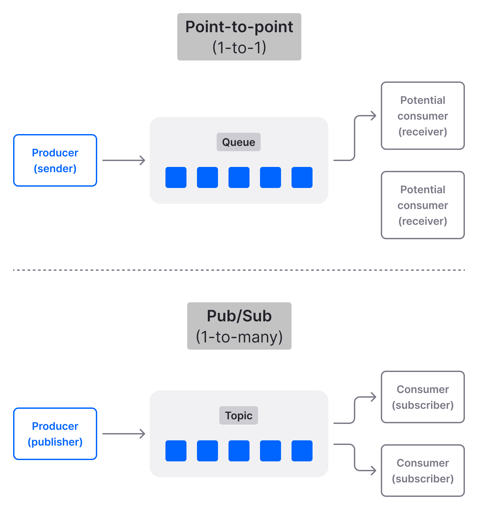

# Notes

## Abstract

Programming paradigms are crucial in understanding and mastering the world of computer science.  
This article will deepen event-driven programming (EDP), a fundamental paradigm where program execution is determined by external events.  
It will explore the key concepts, implementation across various domains, and the advantages and challenges associated with EDP.  
Starting by defining events and examining their role as signals of significant occurrences within systems, then it will delve into the architecture of event-driven systems, involving producers, brokers, and consumers, along with the roles of event listeners and handlers within the event loop mechanism.  
After that, the application of EDP in web development, IoT, AI, and video game development will be illustrated, followed by an outline of the advantages and challenges of EDP.  
This overview underscores the relevance of EDP in modern software engineering, offering insights for developers navigating event-driven architectures.

## Introduction

A programming paradigm is a method or style of programming that defines a set of principles, techniques, and patterns for structuring code to solve problems on a computer. By considering different ways to structure code, it is possible to improve the efficiency and readability of the programs. [4]  
Event-driven programming (EDP) is a programming paradigm where external events determine the flow of program execution. These events come in different shapes: user actions (e.g., button clicks, keyboard inputs), system events (like a finished file download), messages from other programs, sensor outputs, etc. [1]

## Key concepts

Before delving into the complexity of EDP, it is important to explore the key concepts that define the landscape of event-driven programming.

- ### Events

  An event refers to a significant occurrence or change in state within a system or application. [1] It is a signal or notification that something has happened. Events can be triggered by user actions, system actions, or other parts of the program. [6]  
  In simpler words, an event records that something has happened.  
  Here are some common examples of events:

  - A user clicks a button in the UI.
  - Someone makes an online payment.
  - A user sends a chat message.
  - A smartwatch detects an irregular heartbeat.
  - A record is inserted, updated, or deleted in a database.
  - An application is starting or shutting down.

  Here’s an event that signifies a temperature alert was triggered by a sensor installed in a greenhouse:

  ```JSON
  {
    "eventId": "e5f6g7h8-9101-12ij-klmn-opqrs-tuvwxy",
    "eventType": "TemperatureAlert",
    "timestamp": "2024-04-25T08:45:00Z",
    "source": "TemperatureSensor",
    "sensorLocation": "Greenhouse Section A, Row 3",
    "version": "v2.0",
    "data": {
      "sensorId": "TS-123456",
      "temperature": 32.8,
      "threshold": 30.0,
      "unit": "°C",
      "difference": 2.8
    },
    "metadata": {
      "model": "TempGuardian 2000",
      "calibrationDate": "2024-01-10"
    },
    "systemMessage": "Temperature exceeds the acceptable threshold. Activate cooling system. Inspection required."
  }
  ```
  
  In this example:
  
  - `eventID` is the identifier specific to this temperature recording
  - `eventType` specifies the type of event
  - `timestamp` indicates the exact date and time when the event occurred
  - `source` and `sensorLocation` indicate the origin of the event
  - `data` contains readings from the sensor and other relevant metrics
  - `metadata` provides additional information about the sensor
  - `systemMessage` is a huma-readable alert or notice about the event

  Collecting such events enables the company to monitor its temperature system in real time and detect issues as soon as they occur. This way, the staff can quickly react and inspect the issue to adopt the appropriate course of action.  
  
- ### Producers, broker and consumers

  A producer is the source of events in a system. It generates events to signify that something of interest has occurred.  
  A consumer listens for events generated by producers and gets notifications when they come. [1]  
  The broker is responsible for coordinating sending events to the consumers. It is optional when you have a single producer and a single consumer in direct connection with each other. In this case, the producer sends the events to the consumer. [7]  
  It’s also worth mentioning that, depending on the use case, an event producer can also be a consumer. Think, for example, of chat apps: if you send a chat message (an event), you are the producer; on the other hand, if you receive a chat message, you are the event consumer. [1]

  

- ### Event listeners, event handlers, and the event loop

  An event listener is a procedure or function in a computer program that waits for an event to occur.  
  An event handler is the actual code that gets executed when triggered by a specific event. They can be categorized as synchronous if they execute the code immediately when an event occur, or asynchronous if they allow other tasks to continue executing while the code is being processed. [5]  

  These two terms are often used interchangeably, but it is important to distinguish them for several reasons:

  1. More efficient troubleshooting. When debugging, it's essential to know if an issue lies in the event listening mechanism or the event handler.
  2. Flexibility and modularity. Multiple event listeners can trigger the same event handler, and vice versa, a single event listener can trigger different event handlers based on certain conditions. Grasping the distinction between handlers and listeners allows for more flexible and modular coding practices.
  3. Clarity in collaboration. It’s crucial to have clear, shared terminology at a team level. Misunderstandings can arise if one person is discussing a handler while someone else believes they’re talking about a listener.

  The event loop is used by numerous runtimes and frameworks as a sort of intermediary between event listeners and event handlers.  
  One of the main benefits of the event loop is that it enables concurrent execution and non-blocking I/O operations when you’re working with single-threaded programming languages and runtimes.  
  Here is how it works:

  1. Event listeners detect incoming events and place them in an event queue.
  2. The event loop mechanism continually checks for queued events and calls the corresponding event handler for each event. [1]

  

- ### Queues and topics

  When dealing with high volumes of data and numerous producers and consumers in a distributed environment, it’s common practice to use some sort of messaging middleware to intermediate the flow of events between different components. They generally use message queues and topics to route events from producers to consumers.

  A message queue temporarily sotres events generated by producers, ensuring they are processed in a specific order by a consumer. As events occur, they are added to the back of the queue. Once a consumer processes the event, it is deleted from the queue. There can be multiple producers publishing events to a queue; however, on the consumer side, there is a single entity consuming each message (point-to-point messaging).

  A topic is a communication channel specific to publish-subscribe (pub/sub) messaging systems. Producers publish events to topics, and multiple consumers can subscribe to topics to receive events. Unlike queues, events sent to a topic can be consumed by multiple consumers, (one-to-many communication). [1]

  

## Implementation in different contexts

- ### Web developing

  Event-driven programming in web development is crucial for handling dynamic and responsive user interactions. Developers use this technique to manage a wide range of events, such as mouse clicks, key presses, and form submissions. This approach allows them to create engaging and highly dynamic user interfaces, significantly improving the overall user experience on the web.  
  In frameworks like React.js or Angular.js, EDP is used to manage data flow and user interactions. They take advantage of the concept of "components" which can generate, receive, and respond to events asynchronously. For example, in React.js, each component can maintain its own state and handle its events, facilitating the creation of interactive user interfaces. Similarly, Angular.js utilizes "directives" and "observables" to manage events and user input responses, ensuring efficient event handling within web applications.

- ### Internet of Things
  
  Event-driven programming in the Internet of Things is used to manage interaction and data exchange between connected devices. Using this approach, devices can detect and respond to events or user inputs in real-time. For example, temperature sensors sending data to a an alert system when a critical variation is detected. This programming enables the creation of highly responsive IoT systems that adapt to environmental changes or user needs.

- ### AI

  Event-driven programming in artificial intelligence is used to manage the logic of responding to environmental signals or user inputs. This approach allows machine learning algorithms and neural networks to dynamically adapt to changes in the environment or new information received, improving the efficiency of decisions made by artificial intelligence. For the future, it is expected that event-driven programming in artificial intelligence will continue to evolve towards more autonomous and adaptive systems. This may include the integration of reinforcement learning algorithms that continuously learn from environmental feedback, as well as the development of distributed artificial intelligence models capable of handling realtime events on a large scale.

- ### Videogames

  Event-oriented programming in videogame development is used to manage dynamic and responsive interactions between players and game environments.This approach is revolutionary because it allows videogames to respond in real time to player inputs, such as controller movements or key actions, and to create immersive gaming experiences, also simplifying the management of game states. Using event management, developers can implement complex and interactive game mechanics, providing a more dynamic and satisfying gaming experience for users.

## Advantages and disadvantages

EDP brings significant advantages to developers and organizations. Here are the key ones:

- ### Advantages
  
  - Responsive applications: Event-driven programming allows applications to effectively respond to user input, resulting in a more dynamic and user-friendly experience. The event loop and event queue maintain the timely processing of events, ensuring that user interactions are effectively handled. [5]

  - Concurrency and scalability: Event-driven systems can process more than one event at a time, which allows them to deal with numerous simultaneous user interactions or system events. Events can be distributed and processed by multiple consumers in parallel. This means it’s possible to handle large volumes of events without relying on a single consumer, who could be a bottleneck that slows down the system. [1]

  - Modularity and maintainability: The separation of concerns in event-driven applications, through distinct event handlers and event management, promotes modularity and maintainability. Developers can focus on individual event handlers, making it simpler to comprehend, adjust, and augment the software. [5]

  - Real-time processing: In the context of real-time applications, EDP enables the processing of events as they occur, ensuring the continuous distribution of up-to-date information and consistent system responsiveness. [5]

- ### Challenges

  While EDP offers plenty of benefits, it also comes with challenges, such as:

  - Code complexity. Asynchronous code can be hard to understand and debug. In addition, layering multiple events and callbacks can lead to convoluted code. [1]

  - Testing is non-trivial. Emulating real-world event sequences for testing can be difficult. [1]
  
  - Ordering issues. Events may not always execute in the desired order. Race conditions can cause unpredictable results, data corruption, and system instability. [1]

## Conclusion

## Bibliography

[[1]](https://quix.io/blog/what-why-how-of-event-driven-programming#:~:text=Event%2Ddriven%20programming%20(EDP),programs%2C%20sensor%20outputs%2C%20etc.)

[[4]](https://www.studysmarter.co.uk/explanations/computer-science/computer-programming/programming-paradigms/)

[[5]](https://www.studysmarter.co.uk/explanations/computer-science/computer-programming/event-driven-programming/)

[[6]](https://medium.com/@miladev95/event-driven-programming-cbd3ed8ec2ca)

[[7]](https://www.adservio.fr/post/event-driven-architecture)
